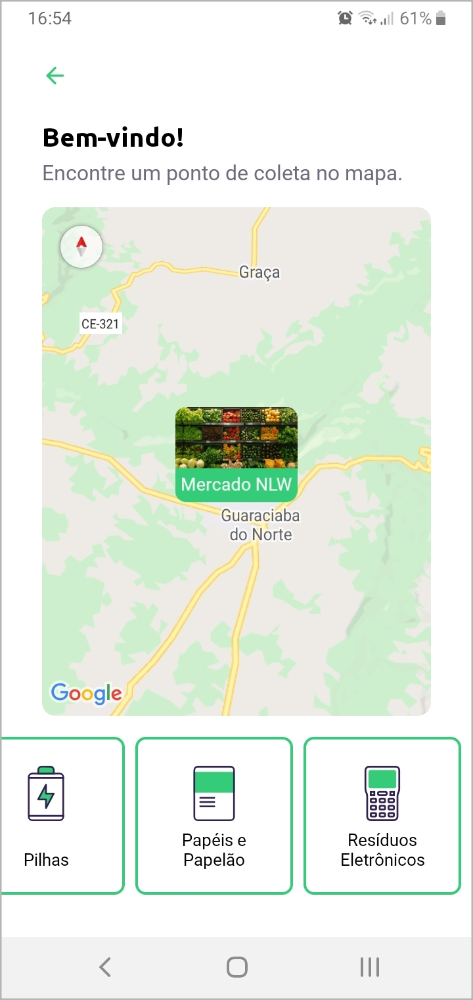

  

# :recycle: Sobre

O <strong>Ecoleta</strong> é uma plataforma criada para gerenciar o processo de coleta de lixo nas cidades. Com ela, é possível ajudar pessoas a encontrarem pontos para coleta de um determinado material de forma mais eficiente. Foi desenvolvida durante a primeira edição da Next Level Week, organizada pela <a href="https://rocketseat.com.br/" target="_blank">Rocketseat</a>.

# :heavy_check_mark: Resultado

<h2 align="center">Web</h2>

  

 

<h2 align="center">Mobile</h2>

  

  

  

# :toolbox: Tecnologias

- Front-end:

  - [ReactJS](https://pt-br.reactjs.org/)
  - [TypeScript](https://www.typescriptlang.org/)

- Back-end:

  - [Node.js](https://nodejs.org/en/)
  - [Knex.js](http://knexjs.org/) com [Sqlite](https://www.sqlite.org/index.html)

- Mobile:

  - [React Native](https://reactnative.dev/)

- Utilitários:
  - [Insomnia](https://insomnia.rest/)
  - [Leaflet](https://leafletjs.com/)
  - [API de localidades do IBGE](https://servicodados.ibge.gov.br/api/docs/localidades?versao=1)
  - [Google Fonts](https://fonts.google.com/)

# :package: Dependências

- [express](https://expressjs.com/pt-br/)
- [ts-node-dev](https://github.com/whitecolor/ts-node-dev)
- [react-leaflet](https://react-leaflet.js.org/)
- [axios](https://github.com/axios/axios)
- [expo](https://expo.io/)
- [multer](https://github.com/expressjs/multer)
- [react-dropzone](https://github.com/react-dropzone/react-dropzone)
- [celebrate](https://github.com/arb/celebrate)

# :speech_balloon: Considerações

Neste projeto, tive meu primeiro contato com Node.js, React Native e também com alguns conceitos de TypeScript, o que me fez ter mais vontade de me aprofundar no vasto universo do desenvolvimento web e mobile, seja no campo do front-end como do back-end.

Apesar de ter mais familidaridade com a parte visual, como cientista da computação, acho imprescindível saber como estas duas áreas se integram. Desta forma, após um passo de cada vez, e superando minhas limitações, vou buscando sempre atingir o "próximo nível".

